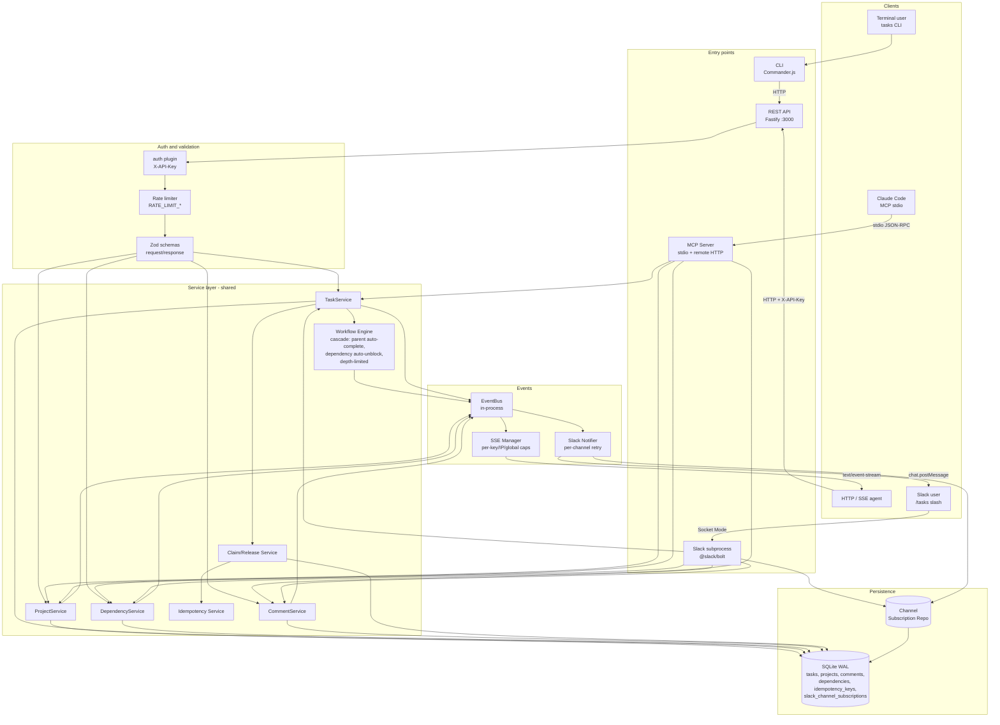

# Wood Fired Bugs

[](https://github.com/Wood-Fired-Games/wood-fired-bugs/actions/workflows/ci.yml)
[](https://github.com/Wood-Fired-Games/wood-fired-bugs/actions/workflows/install-scripts.yml)
[](LICENSE)

Open-source task tracking system from Wood Fired Games.

Wood Fired Bugs is a centralized task management service providing a REST API, CLI tool, and MCP server for managing work items across all projects. LLM agents interact via REST or MCP; humans interact via CLI. All three interfaces share a common service layer and SQLite database with full feature parity. Real-time SSE event streaming enables multi-agent coordination with atomic task claiming and workflow automation.

**Key capabilities:**

- REST API with 22 authenticated endpoints for full task lifecycle management
- CLI (`tasks`) with 26 commands for terminal-based operations
- MCP server with 21 tools for native Claude Code integration (local SQLite or remote HTTP modes)
- 11 task-loop skill files that ship as Claude Code slash commands today; the underlying recipes are vendor-neutral and any agent harness can consume them
- Real-time Server-Sent Events (SSE) for task change notifications
- Atomic task claiming with optimistic locking for multi-agent coordination
- Workflow automation: parent auto-complete and dependency auto-unblock
- SQLite database with WAL mode, FTS5 full-text search, and automatic migrations
- Cross-platform installers for Linux/macOS and Windows

## For agents

Coding agents (Claude Code, Cursor, Gemini, Codex, and others) should start with:

1. [AGENTS.md](AGENTS.md) — first-read navigation hub.
2. [docs/AGENT_CONTEXT.md](docs/AGENT_CONTEXT.md) — the vendor-neutral context contract.
3. [.agent-context.json](.agent-context.json) — machine-readable manifest of canonical files and their budgets.

Vendor-specific files (`CLAUDE.md`, `.cursor/`, `.gemini/`, `.codex/`) are adapters and MUST NOT carry unique facts — see `docs/AGENT_CONTEXT.md` §6.

## Quick Start

```bash
# Clone and install
git clone https://github.com/Wood-Fired-Games/wood-fired-bugs.git
cd wood-fired-bugs
npm install
npm run build

# Set environment variables
export API_KEYS="your-api-key-here"
export DATABASE_PATH="./data/tasks.db"

# Run database migrations
npm run migrate

# Start the API server
npm start

# Use the CLI
tasks list
tasks create --title "My first task" --project 1 --created-by "me"
```

For detailed setup instructions, see [docs/SETUP.md](docs/SETUP.md).

For self-hosted production: operators provision a host once with `deploy/install.sh` and ship every subsequent release in place with `deploy/upgrade.sh` (atomic backup, migrate, restart, /health probe, rollback recipe on failure). See `docs/SETUP.md` for the walkthrough.

## Security Model

**Read this before deploying.** Wood Fired Bugs is designed for trusted multi-agent coordination on a private network. The auth model is intentionally simple and reflects that scope. OSS operators who assume "API key = user login" will mis-deploy this service.

### Every valid API key has full admin power

The auth plugin (`src/api/plugins/auth.ts`) validates only that the supplied `X-API-Key` header matches one of the configured keys. There is:

- **No per-user identity.** The server does not know who is calling — only that they hold a valid key.
- **No project ACL.** Any valid key can read, write, and delete tasks/projects/comments/dependencies across every project in the database.
- **No scoped tokens.** There are no read-only keys, no per-route keys, no expiring tokens. A leaked key has full admin power until it is rotated out of `API_KEYS`.
- **No enforcement of `created_by` / `assignee`.** These are caller-supplied strings. An agent holding any valid key can create or claim a task as any identity it likes. They are convention-only fields useful for filtering and display, not authorization.

### Operator obligations

- **Issue one key per machine/agent.** This lets you revoke an individual key (by removing it from `API_KEYS` and restarting) without rotating credentials for every other agent. The `API_KEYS` env var accepts a comma-separated list specifically so you can revoke piecewise.
- **Never share keys between humans or services.** Treat keys like SSH private keys — one per identity.
- **Label your keys.** `API_KEYS` accepts entries of the form `key:label` (alongside bare keys) so per-request audit logs identify the caller by label. Example:
  ```
  API_KEYS=abc123def456...:alice-laptop,xyz789...:ci-runner,bare-key-no-label
  ```
  Bare keys get an auto-label `key_<first8>` derived from the first 8 characters of the raw key. The label appears in every per-request log line as `apiKeyLabel=<label>`; the raw key value is never logged.
- **Reference [SECURITY.md](SECURITY.md) for incident response** (key compromise, rotation, disclosure).

### Defense in depth

The auth layer is paired with two additional protections, both configurable:

- **Rate limiting** via `@fastify/rate-limit` (global, 1000 req/min default) — tunable through `RATE_LIMIT_MAX` and `RATE_LIMIT_TIME_WINDOW`. Caps brute-force attempts on the auth endpoint and protects against runaway agents.
- **SSE connection caps** — per-key, per-IP, and global limits on long-lived event-stream connections (`SSE_MAX_CONNECTIONS_PER_KEY` / `SSE_MAX_CONNECTIONS_PER_IP` / `SSE_MAX_CONNECTIONS`). Prevents connection exhaustion from a misbehaving or compromised key.

These are mitigations, not authorization. They reduce blast radius; they do not substitute for proper key hygiene.

### Future work

Scoped/role-based tokens are tracked for a possible v1.0 milestone but are not on the v0.x roadmap. If your deployment requires per-user access control, fronting this service with an authenticating reverse proxy (which sets `X-API-Key` per-tenant after its own auth) is the recommended path until scoped tokens land.

## Architecture

The service is a single Node process exposing three peer entry points
(REST, CLI, MCP) over a shared service layer, plus an optional Slack
subprocess that reuses the same services and database. Real-time events
flow through an in-process EventBus to the SSE Manager (browser/agent
consumers) and the Slack notifier (channel subscribers).



| Interface | Access Method | Transport | Auth |
|-----------|--------------|-----------|------|
| REST API | HTTP endpoints | Port 3000 (configurable) | X-API-Key header |
| CLI | `tasks` command | HTTP to API server (most cmds); direct SQLite for offline ops (`backup`, `doctor`, `stats`, `db-check`, `completed`) | API_KEY env var |
| MCP Server | stdio JSON-RPC (local) or HTTP (remote variant) | MCP client integration | None for stdio (local access); X-API-Key for remote |
| Slack subprocess | Slack Socket Mode | WebSocket to Slack | Slack signing secret + bot token |

All entry points share the same TypeScript services
(TaskService, ProjectService, DependencyService, CommentService), the
Workflow Engine (cascades parent auto-complete and dependency
auto-unblock; depth-limited and wrapped in a transaction), and the same
SQLite database in WAL mode. The Slack notifier is a downstream
EventBus subscriber — it never blocks task mutations, retries transient
errors twice, and short-circuits permanent errors
(`not_in_channel`, `channel_not_found`, `invalid_auth`, `token_revoked`).

## Data Model

### Entities

| Entity | Key Fields |
|--------|------------|
| **projects** | id, name, description, created_at, updated_at |
| **tasks** | id, title, description, status, priority, project_id, parent_task_id, estimated_minutes, assignee, created_by, due_date, version, claimed_at, **completed_at**, created_at, updated_at |
| **task_tags** | id, task_id, tag |
| **dependencies** | id, task_id, blocks_task_id, created_at |
| **comments** | id, task_id, author, content, created_at, updated_at |
| **idempotency_keys** | key, response, created_at |
| **slack_channel_subscriptions** | id, channel_id, project_id, event_type, created_at (UNIQUE on the triple) |

### Task Statuses

Valid statuses: `open`, `in_progress`, `done`, `closed`, `blocked`, `backlogged`

- `backlogged` is "deferred but not abandoned" — distinct from `closed` (won't-do / archive).
- `completed_at` is populated only when a task transitions **into** `done`,
  and cleared if it transitions back out (e.g. `done → open`). `closed` is
  intentionally not treated as completion (separate terminal state).

### Task Priorities

Valid priorities: `low`, `medium`, `high`, `urgent`

### Status Transitions

| From Status | Allowed Transitions |
|-------------|---------------------|
| open | in_progress, blocked, closed, backlogged |
| in_progress | done, blocked, open |
| blocked | open, in_progress |
| backlogged | open |
| done | closed, open |
| closed | open |

(Canonical source: `VALID_STATUS_TRANSITIONS` in [`src/types/task.ts`](src/types/task.ts).)

## API Summary

All endpoints under `/api/v1` require authentication via `X-API-Key` header.

Base URL: `http://localhost:3000`

### Health

| Method | Path | Description |
|--------|------|-------------|
| GET | /health | Service health check (no auth required) |

### Projects

| Method | Path | Description |
|--------|------|-------------|
| POST | /api/v1/projects | Create a new project |
| GET | /api/v1/projects | List all projects |
| GET | /api/v1/projects/:id | Get project by ID |
| PUT | /api/v1/projects/:id | Update project |
| DELETE | /api/v1/projects/:id | Delete project |

### Tasks

| Method | Path | Description |
|--------|------|-------------|
| POST | /api/v1/tasks | Create a new task |
| GET | /api/v1/tasks | List tasks with filters |
| GET | /api/v1/tasks/:id | Get task by ID |
| PUT | /api/v1/tasks/:id | Update task |
| DELETE | /api/v1/tasks/:id | Delete task |
| POST | /api/v1/tasks/:id/claim | Atomically claim an unassigned task |
| GET | /api/v1/tasks/:id/subtasks | Get subtasks of a task |

### Comments

| Method | Path | Description |
|--------|------|-------------|
| POST | /api/v1/tasks/:id/comments | Add comment to task |
| GET | /api/v1/tasks/:id/comments | List comments for task |
| DELETE | /api/v1/tasks/:id/comments/:commentId | Delete comment |

### Dependencies

| Method | Path | Description |
|--------|------|-------------|
| POST | /api/v1/tasks/:id/dependencies | Add dependency (this task blocks another) |
| GET | /api/v1/tasks/:id/dependencies | Get dependencies for task |
| DELETE | /api/v1/tasks/:id/dependencies/:blocksTaskId | Remove dependency |

### Events

| Method | Path | Description |
|--------|------|-------------|
| GET | /api/v1/events | Subscribe to real-time SSE event stream |

For detailed API documentation including request/response schemas, see [docs/API.md](docs/API.md).

## CLI Summary

The `tasks` command provides terminal access to all task operations.

**Global Flags:**
- `--json` - Output in machine-readable JSON format
- `--no-input` - Disable interactive prompts
- `--force` - Skip confirmation prompts

### Task Commands

| Command | Description |
|---------|-------------|
| tasks create | Create a new task (interactive or with options) |
| tasks list | List tasks with filters |
| tasks show \<id\> | Show task details |
| tasks update \<id\> | Update task fields |
| tasks delete \<id\> | Delete a task |
| tasks claim \<id\> | Atomically claim an unassigned task |

### Project Commands

| Command | Description |
|---------|-------------|
| tasks project-create | Create a new project |
| tasks project-list | List all projects |
| tasks project-show \<id\> | Show project details |
| tasks project-update \<id\> | Update project |
| tasks project-delete \<id\> | Delete project |

### Dependency Commands

| Command | Description |
|---------|-------------|
| tasks dep-add \<taskId\> \<blocksTaskId\> | Add dependency relationship |
| tasks dep-remove \<taskId\> \<blocksTaskId\> | Remove dependency |
| tasks dep-list \<taskId\> | List dependencies for task |

### Comment Commands

| Command | Description |
|---------|-------------|
| tasks comment-add \<taskId\> | Add comment to task |
| tasks comment-list \<taskId\> | List comments for task |
| tasks comment-delete \<commentId\> | Delete comment |

### Subtask Commands

| Command | Description |
|---------|-------------|
| tasks subtask-create \<parentTaskId\> | Create a subtask |
| tasks subtask-list \<parentTaskId\> | List subtasks |

### Health

| Command | Description |
|---------|-------------|
| tasks health | Check server health |

For detailed CLI documentation including all options and examples, see [docs/CLI.md](docs/CLI.md).

## MCP Tools Summary

The MCP server exposes 21 tools and 1 resource for Claude Code integration. A second entry point (`npm run mcp:remote`) exposes the full REST-backed tool surface (21 tools) for clients running on a different host than the bugs API — see [docs/MCP.md#remote-mcp-server](docs/MCP.md#remote-mcp-server).

### Task Tools (9)

| Tool | Description |
|------|-------------|
| create_task | Create a new task in a project |
| get_task | Get a task by its ID |
| update_task | Update an existing task |
| list_tasks | List tasks with optional filters and pagination |
| delete_task | Delete a task by its ID |
| claim_task | Atomically claim an unassigned task |
| list_subtasks | Paginated list of subtasks for a parent task |
| get_subtasks | Paginated subtasks for a parent task (alternative shape) |
| completion_report | Dashboard of tasks completed in a window with per-project/assignee/priority aggregates |

### Project Tools (5)

| Tool | Description |
|------|-------------|
| create_project | Create a new project |
| get_project | Get a project by its ID |
| list_projects | List all projects |
| update_project | Update an existing project |
| delete_project | Delete a project by its ID |

### Comment Tools (3)

| Tool | Description |
|------|-------------|
| add_comment | Add a comment to a task |
| get_comments | Get all comments for a task |
| delete_comment | Delete a comment by ID |

### Dependency Tools (3)

| Tool | Description |
|------|-------------|
| add_dependency | Add a dependency relationship between tasks |
| remove_dependency | Remove a dependency relationship |
| get_dependencies | Get all dependencies for a task |

### Health Tools (1)

| Tool | Description |
|------|-------------|
| check_health | Check service health status |

### Resources (1)

| URI | Description |
|-----|-------------|
| events://stream | SSE event stream discovery documentation |

For detailed MCP documentation including tool schemas and Claude Code skill files, see [docs/MCP.md](docs/MCP.md).

## Real-Time Events

Wood Fired Bugs streams real-time task and project change notifications via Server-Sent Events (SSE).

### Event Types

| Event | Trigger |
|-------|---------|
| task.created | New task created |
| task.updated | Task fields modified |
| task.deleted | Task deleted |
| task.status_changed | Task status transition |
| task.claimed | Task claimed by agent |
| project.created | New project created |
| project.updated | Project modified |
| project.deleted | Project deleted |

### Subscribing

```bash
# Subscribe to all events
curl -N -H "X-API-Key: your-key" \
  http://localhost:3000/api/v1/events

# Filter by project
curl -N -H "X-API-Key: your-key" \
  "http://localhost:3000/api/v1/events?project_id=1"

# Filter by event type
curl -N -H "X-API-Key: your-key" \
  "http://localhost:3000/api/v1/events?event_types=task.created,task.claimed"
```

### Reconnection

Include `Last-Event-ID` header to resume from where you left off:

```bash
curl -N -H "X-API-Key: your-key" \
  -H "Last-Event-ID: 42" \
  http://localhost:3000/api/v1/events
```

## Multi-Agent Coordination

### Atomic Task Claiming

Multiple agents can race to claim the same task. Exactly one wins; the rest receive a 409 Conflict. This uses optimistic locking with a version field and `BEGIN IMMEDIATE` transactions in SQLite.

```bash
# Claim a task
curl -X POST http://localhost:3000/api/v1/tasks/42/claim \
  -H "X-API-Key: your-key" \
  -H "Content-Type: application/json" \
  -d '{"assignee": "agent-1"}'

# With idempotency key (safe to retry)
curl -X POST http://localhost:3000/api/v1/tasks/42/claim \
  -H "X-API-Key: your-key" \
  -H "X-Idempotency-Key: unique-key-123" \
  -H "Content-Type: application/json" \
  -d '{"assignee": "agent-1"}'
```

- Verified with 20 concurrent agents: exactly 1 success, 19 conflicts, 0 errors
- Stale claims auto-released after 30 minutes of inactivity
- Idempotency keys prevent duplicate claims (24h TTL)

### Workflow Automation

When tasks change status, the system automatically:

- **Parent auto-complete:** When all subtasks reach `done`, parent task transitions to `done`
- **Dependency auto-unblock:** When a blocking task completes, blocked dependents transition from `blocked` to `open`

Cascades are depth-limited (max 5 levels) and wrapped in transactions for atomicity.

## Configuration

### Environment Variables

| Variable | Description | Default |
|----------|-------------|---------|
| PORT | HTTP server port | 3000 |
| HOST | HTTP server host. Defaults to loopback only; set to `0.0.0.0` (or a specific LAN IP) to expose on the network. | 127.0.0.1 |
| API_KEYS | Comma-separated API keys for authentication | (none - auth disabled) |
| LOG_LEVEL | Logging level (debug, info, warn, error) | info |
| NODE_ENV | Environment (development, production) | (none) |
| DATABASE_PATH | Path to SQLite database file (canonical; MCP server also accepts legacy `DB_PATH`) | ./data/tasks.db |
| API_BASE_URL | Base URL for CLI API calls | http://localhost:3000 |
| API_KEY | API key for CLI authentication | (none) |
| SLACK_BOT_TOKEN / SLACK_APP_TOKEN / SLACK_SIGNING_SECRET | Optional Slack integration (all three required together) — see [docs/SLACK.md](docs/SLACK.md) | (none) |
| RATE_LIMIT_MAX / RATE_LIMIT_TIME_WINDOW | Global rate limiter knobs | 1000 / "1 minute" |
| SSE_MAX_CONNECTIONS_PER_KEY / SSE_MAX_CONNECTIONS_PER_IP / SSE_MAX_CONNECTIONS | SSE connection caps | 4 / 8 / 200 |
| ENABLE_SWAGGER_IN_PRODUCTION | Opt-in to expose Swagger UI when `NODE_ENV=production` | false |

[NOTE] The full env-var reference (including server timeouts and installer
variables) lives in [docs/SETUP.md → Environment Variables](docs/SETUP.md#environment-variables).

## Development

### Key Commands

```bash
# Development mode with hot reload
npm run dev

# Run tests (1300 tests across 101 files)
npm test

# Watch mode for tests
npm run test:watch

# Build TypeScript
npm run build

# Run CLI in development (without building)
npm run cli -- <command>

# Run MCP server in development
npm run mcp:dev
```

### Database

SQLite with better-sqlite3 driver, WAL mode, and automatic migrations via Umzug. Seven migration files in `src/db/migrations/`:

1. `001-initial-schema.ts` — projects, tasks, task_tags, dependencies, comments
2. `002-task-hierarchy-and-dependencies.ts` — task hierarchy and dependency tracking
3. `003-comments-and-estimates.ts` — comments and time estimates
4. `004-claim-protocol.ts` — version field, claimed_at, idempotency_keys table
5. `005-backlogged-status.ts` — adds `backlogged` to the status CHECK constraint (rebuilds tasks table; preserves FTS triggers)
6. `006-slack-channel-subscriptions.ts` — `slack_channel_subscriptions` table for the Slack notifier
7. `007-completed-at.ts` — `completed_at` column on tasks (set on transition into `done`, backfilled from `updated_at`)

### Testing

1300 tests across 101 test files covering:
- Service layer unit tests
- API route integration tests (all endpoints)
- MCP tool tests (all tools)
- CLI command tests
- Event system tests (EventBus, SSEManager, events API)
- Claim protocol tests (including 20-agent concurrency)
- Workflow engine tests (auto-complete, auto-unblock, cascade depth)
- Skill file validation tests

### Code Quality Roadmap

The current TypeScript service quality baseline and the prioritized
uplift roadmap (lint/format gate, stricter compiler flags, architecture
guardrails, migration safety, CI/release automation) live in
[docs/CODE_QUALITY_ROADMAP.md](docs/CODE_QUALITY_ROADMAP.md). It is the
source of truth for the `Code Quality Uplift Roadmap` project tracked
in the bugs database and should be linked from future PR/release
quality checklist work.

## Integrations

### Slack

Wood Fired Bugs ships an **optional** Slack integration:

- `/tasks` slash command (read, create, update, claim, subscribe channels to notifications, …)
- A notifier that posts Block Kit messages to subscribed channels when
  task events fire on the internal EventBus.

Slack is fully optional — leave `SLACK_BOT_TOKEN`, `SLACK_APP_TOKEN`, and
`SLACK_SIGNING_SECRET` unset and the service runs without it. The three
variables are validated as a group (all three, or none).

See [docs/SLACK.md](docs/SLACK.md) for: app manifest, required scopes,
slash-command reference, channel subscription model, error handling.

### Claude Code (MCP)

The shipped MCP server registers as a stdio MCP target in `~/.claude.json`
and exposes 21 tools plus the `/tasks:*` skill files. See
[docs/MCP.md](docs/MCP.md) and the "Claude Code Integration" section in
[docs/SETUP.md](docs/SETUP.md#claude-code-integration).

## Release Verification

Before publishing to npm, run `npm run pack:check` (alias for
`npm pack --dry-run`) and inspect the printed file list. Confirm that
`dist/` JS + `.d.ts` files, `LICENSE`, `README.md`, `CHANGELOG.md`, and
`SECURITY.md` are present, and that `src/`, `.env*`, `data/*.db`,
`.planning/`, and test files are **absent**. The package uses an explicit
`files` allowlist in `package.json` — adjust it there if the output drifts.

## License

MIT
