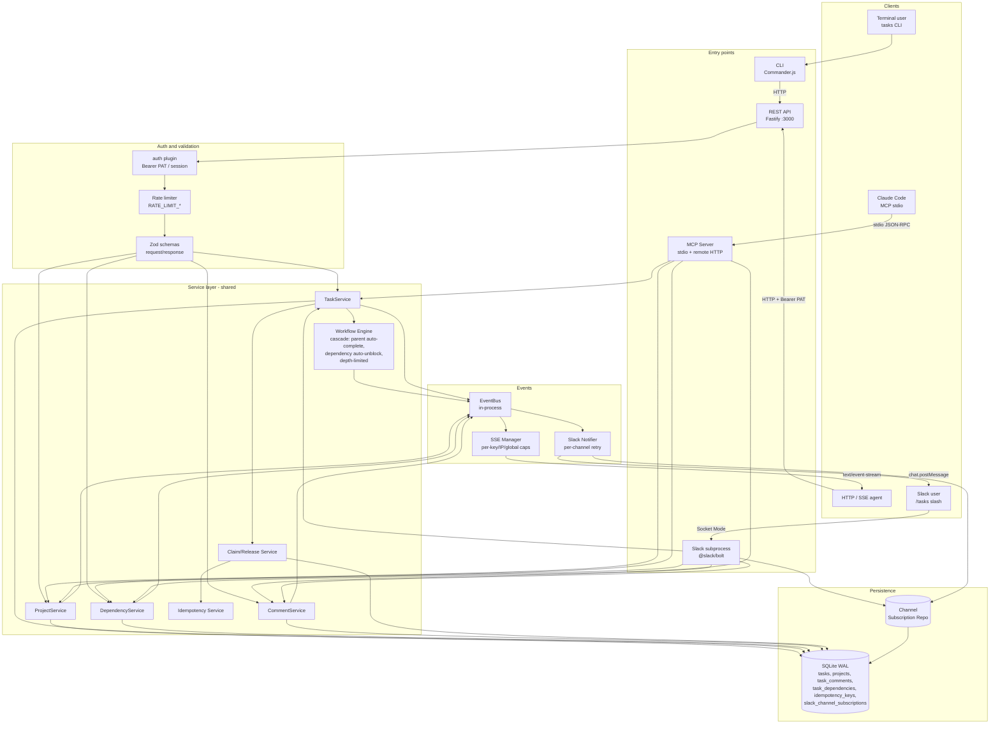

# Wood Fired Tasks

[](https://github.com/Wood-Fired-Games/wood-fired-tasks/actions/workflows/ci.yml)
[](https://github.com/Wood-Fired-Games/wood-fired-tasks/actions/workflows/install-scripts.yml)
[](LICENSE)

Wood Fired Tasks is open-source coordination infrastructure for fleets of AI coding agents — the missing primitive between "I have one Claude Code session running" and "I have ten of them working the same backlog without stepping on each other." You point Claude Code (or Cursor, Gemini, Codex) and a `tasks` CLI at one shared, SQLite-backed service — over MCP, REST, or the CLI, all at full feature parity — and every surface reads and writes the same source of truth. The coordination primitives are first-class: atomic task claiming with optimistic locking (20 agents race, exactly one wins), workflow automation that auto-unblocks dependents and auto-completes parents as subtasks finish, and a real-time SSE event stream keeping every agent and dashboard in sync. On top of that, a set of `/tasks:*` skills turn a project-level goal into a decomposed, executable, auditable plan — and an optional economic prioritizer (WSJF) can rank the backlog by value-per-effort so the loops drain the most-unblocking work first. Self-hostable and MIT-licensed; one server can be shared by a whole team across Windows, Linux, and macOS.

**What you actually do with it:**

- **Coordinate a fleet on one backlog** — many agents claim, complete, and unblock work against a single shared service without colliding.
- **Go from idea → plan → decompose → execute → audit** with the `/tasks:*` skills (see [The workflow](#the-workflow) and the real-usage [playbook](docs/USAGE_PATTERNS.md)).
- **Run it on-prem for your team** — one self-hosted server, with Windows/Linux/macOS clients all pointed at it ([multi-OS fleet setup](docs/SETUP.md#multi-os-client-fleet-one-shared-on-prem-server)).

**Key capabilities:**

- `/tasks:*` skill files implementing the plan→decompose→loop→audit lifecycle (ship as Claude Code slash commands; the recipes are vendor-neutral)
- MCP server with 27 tools for native agent integration (local SQLite or remote HTTP modes) + cross-platform installers (Linux/macOS and Windows)
- REST API with 52 route handlers across `src/api/routes/` (1 public `/health`; the rest authenticated; a single instance serves up to 45 — OIDC-disabled stubs are mutually exclusive with the live OIDC routes) and a `tasks` CLI with 42 commands
- Atomic task claiming with optimistic locking + workflow automation (parent auto-complete, dependency auto-unblock) for multi-agent coordination
- Real-time Server-Sent Events (SSE) for task/project change notifications
- SQLite database with WAL mode, FTS5 full-text search, and automatic migrations
- **Optional WSJF prioritization** — economic backlog ordering most trackers don't offer: variance-enforced column anchoring (recovers a real ranking from an "everything is high" backlog) and propagation-adjusted effective WSJF (surfaces the prerequisite that unblocks the most downstream value). Opt-in and backward-compatible. [Details ↓](#wsjf-prioritization)

## The workflow

The `/tasks:*` skills turn a high-level goal into a drained, audited backlog. The
canonical lifecycle:

```
 plan ─────▶ /tasks:decompose ─────▶ /tasks:loop      (FLAT — sequential)
(brainstorm   into a dedicated         or
 or your own  project (8–25 tasks    /tasks:loop-dag  (DAG — parallel waves) ─────▶ /tasks:audit
 plan file)   or a dependency DAG)
```

- **`/tasks:decompose <plan-or-goal>`** turns a project goal (or a written plan) into
  8–25 independent leaf tasks or a dependency DAG. It *plans only* — it never executes
  what it creates, refuses blast-radius goals, and supports `--dry-run`.
- **`/tasks:loop` / `/tasks:loop-dag`** drain the backlog autonomously: a subagent
  implements each task, the orchestrator re-verifies with your build/test commands,
  closes it, commits, and moves on. `loop` runs a FLAT backlog in sequence; `loop-dag`
  runs a dependency DAG wave-by-wave in parallel.
- **`/tasks:audit`** grades the closed work against its acceptance criteria.

That is the skeleton. The patterns people actually run — draining a big project across
many context clears, the *surface-and-file* capture loop, scoped subset loops,
branch → PR → independent-review → merge, and the single-threaded **live-verified**
fallback when an autonomous run can't be trusted — are written up with illustrative
command sequences in **[docs/USAGE_PATTERNS.md](docs/USAGE_PATTERNS.md)**.

Because the loops close tasks on agent-written evidence, they ship with
anti-fabrication guardrails (the opt-in `WFT_STRICT_EVIDENCE` server gate, an optional
client-side SHA hook, and skill-level discipline) — see
[docs/RELIABILITY.md](docs/RELIABILITY.md).

## For agents

Coding agents (Claude Code, Cursor, Gemini, Codex, and others) should start with:

1. [AGENTS.md](AGENTS.md) — first-read navigation hub.
2. [docs/AGENT_CONTEXT.md](docs/AGENT_CONTEXT.md) — the vendor-neutral context contract.
3. [.agent-context.json](.agent-context.json) — machine-readable manifest of canonical files and their budgets.

Vendor-specific files (`CLAUDE.md`, `.cursor/`, `.gemini/`, `.codex/`) are adapters and MUST NOT carry unique facts — see `docs/AGENT_CONTEXT.md` §6.

## Quick Start

Install from npm — **no git clone, no build, no admin rights.** The global
install ships the server, the `tasks` CLI, the MCP bridge, and the `/tasks:*`
skills together; `setup` wires them into Claude Code and `serve` runs the API.

```bash
# 1. Install the CLI globally (never needs sudo — see the admin-free note below)
npm i -g wood-fired-tasks

# 2. Wire it into Claude Code: merges the local stdio MCP server into
#    ~/.claude.json and copies the /tasks:* skills + subagents — idempotent,
#    no manual JSON editing.
wood-fired-tasks setup

# 3. Run the API server. Migrates the OS app-data DB on start and listens on
#    127.0.0.1:3000 (set HOST=0.0.0.0 to expose on the LAN).
wood-fired-tasks serve
```

Restart Claude Code after `setup` and the `/tasks:*` commands and MCP tools are
live. Then create a project, capture its id, add a task, and list:

```bash
wood-fired-tasks --json project-create --name "My Project"
#  → {"success":true,"data":{"project":{"id":2,...}},"metadata":{"id":2}}
wood-fired-tasks create --title "My first task" --project 2 --created-by "me"
wood-fired-tasks list --project 2
```

> Do NOT assume a project id 1 exists — always create one first and use the id
> it returns.

**Admin-free guarantee.** No step ever escalates: `setup`, `serve`,
`self-update`, and `service install` refuse to shell out to `sudo` / `runas` /
`pkexec` / `doas`. If a global `npm i -g` hits an EACCES on a root-owned npm
prefix, run `wood-fired-tasks setup --fix-npm-prefix` to point npm at a
user-writable prefix (`~/.npm-global`) and re-run **without** sudo. The one and
only path that elevates is the opt-in system-wide service
(`wood-fired-tasks service install --system`); everything else stays in your
user scope.

**Keep it running and up to date.**

```bash
wood-fired-tasks service install   # Linux: user-scoped systemd unit (admin-free)
wood-fired-tasks self-update       # npm i -g wood-fired-tasks@latest (no sudo)
```

**Point at a shared remote server** instead of running it locally:

```bash
wood-fired-tasks setup --remote https://tasks.example.com --token wft_pat_…
```

This writes a URL-only `wood-fired-tasks-remote` MCP entry (proxying every tool
to the REST API) and persists the validated PAT to the CLI credentials file —
the same file `tasks login` writes; the bridge reads its bearer token from there
at runtime (the PAT is never stored in `~/.claude.json`). Omit `--token` to run
the interactive device-flow / manual-PAT onboarding instead. For a full
Windows/Linux/macOS fleet on one on-prem server, see
[Multi-OS client fleet](docs/SETUP.md#multi-os-client-fleet-one-shared-on-prem-server).

Browse the bundled guides from anywhere with `wood-fired-tasks docs list` /
`docs show setup`. For detailed setup — local, remote, update, serve, and the
background service — see [docs/SETUP.md](docs/SETUP.md). Working from a clone for
development instead? See [docs/SETUP.md → Development Setup](docs/SETUP.md#development-setup).

## Self-hosting

For self-hosted production deploys (including the fork-and-deploy workflow for OSS operators): provision a host once with `deploy/install.sh`, then ship every subsequent release in place with `deploy/upgrade.sh` (atomic backup, migrate, restart, `/health` probe, manual rollback recipe on failure). The full walkthrough — first-time install, in-place upgrades, deploying your fork, manual rollback, and the migration safety contract — lives at [Self-hosting and upgrades](docs/SETUP.md#self-hosting-and-upgrades). When a deploy or a reboot goes sideways, the [Troubleshooting & Recovery runbook](docs/TROUBLESHOOTING.md) covers boot failures (`exit 78`), wrong/stale-database symptoms, and safe backup/restore.

**Sharing one server across a team.** The common shape is a single on-prem server with a fleet of Windows, Linux, and macOS workstations all pointed at it in remote mode (each client proxies its MCP tool calls to the shared REST API, so everyone sees one backlog). The end-to-end recipe — make the server reachable behind TLS, mint one revocable PAT per machine, and run `wood-fired-tasks setup --remote <url> --token wft_pat_…` on each OS — is the [Multi-OS client fleet](docs/SETUP.md#multi-os-client-fleet-one-shared-on-prem-server) section.

## Automation (event-driven)

Beyond the REST/CLI/MCP surfaces, an optional **event-router daemon** —
[`wft-router`](packages/wft-router/README.md) — subscribes to the API's SSE
event stream (`GET /api/v1/events`) and dispatches matched task events to
vendor-neutral handlers (`create_task_in_project`, `webhook_post`, `shell_exec`,
`agent_session_dispatch`) per a declarative `triggers.yaml`. It **ships inside
the `wood-fired-tasks` package** — once installed, run it with `wft-router`
(or `npx wft-router`); validate a config with `wft-router --validate
triggers.yaml`. It adds nothing to the core server unless you run it. See the
[design doc](docs/event-router-design.md), the
[automation recipes](docs/automation-recipes/), and the
[reference adapters](examples/adapters/). For agents that just need to block on
a single task unblock, the MCP server also exposes a `wait_for_unblock` tool
(see [docs/MCP.md](docs/MCP.md)).

## Security Model

**Read this before deploying.** Wood Fired Tasks is built for trusted multi-agent coordination. As of **v2.0** the REST API authenticates every `/api/v1` request through a two-strategy chain (`src/api/plugins/auth/index.ts`), tried in order — the first strategy that produces a valid user wins, and that user's id is stamped onto every write (`created_by_user_id`, `assignee_user_id`, …) and the per-request audit log (`user_id`, `token_id`, `auth_method`):

| Order | Strategy | Credential | Wire format |
|-------|----------|------------|-------------|
| 1 | **PAT** — recommended for machines/agents | row in `api_tokens` (SHA-256 hash stored) | `Authorization: Bearer wft_pat_<…>` |
| 2 | **Session** — recommended for humans | OIDC sign-in → sealed-box cookie | `Cookie: wft_session=<…>` |

PATs are minted from a logged-in `/me` web session or offline via `tasks db mint-token`; the raw value is shown **once** at mint time (only a hash is stored) and revoked via the `/me` UI, `DELETE /me/tokens/:id`, or `tasks logout`. Sessions come from OIDC (`/auth/login` → provider → `/auth/callback`, protected by PKCE + state), are sealed-box-encrypted with `SESSION_COOKIE_SECRET`, and expire after 8h. The CLI and remote MCP client send the PAT as `Authorization: Bearer`. Full detail: [SECURITY.md → Authentication Architecture](SECURITY.md#authentication-architecture).

### ⚠️ Authentication is NOT authorization — every identity is admin

**Read this before exposing the service to anything but trusted callers.**

- **Authentication ≠ authorization.** The auth chain only *identifies* the caller; it does **not** scope what they may do.
- **Every authenticated identity is effectively an admin.** Any valid credential — PAT or OIDC session — can read, write, and delete **every** task, project, comment, and dependency across **every** project in the database.
- **There is NO RBAC, NO ACL, and NO per-project / per-tenant isolation.** These are not implemented; scoped/role-based permissions are tracked only as future work.
- **Do NOT expose this service on a public network, and do NOT run it multi-tenant, without an external authorization layer** (e.g. an authenticating reverse proxy that enforces its own per-tenant access control in front of the API). Treat any issued credential as full admin access to all data.

### Legacy `X-API-Key` was removed in v2.0

The legacy `X-API-Key` shared-secret strategy was **removed entirely in v2.0** (`src/api/plugins/auth/index.ts` no longer accepts it). A request carrying only `X-API-Key` now gets **401**. `API_KEYS` is no longer an auth method and is **not** a required env var — it is not in the Zod env schema. If set, it only (optionally) seeds inert legacy `users` rows (`is_legacy=1`) for display/back-reference; those rows hold no usable credential. Every deployment must now issue **PATs** — one per machine/agent, so you can revoke an individual token without disturbing others — or use OIDC sessions. PATs are minted from a `/me` web session or offline via `tasks db mint-token`. See [SECURITY.md → Authentication Architecture](SECURITY.md#authentication-architecture) and `tasks db migrate-identities` for the migration path off legacy keys.

### Defense in depth

Auth is paired with two configurable protections, both mitigations rather than authorization:

- **Rate limiting** via `@fastify/rate-limit` (global, 1000 req/min default) — tunable through `RATE_LIMIT_MAX` and `RATE_LIMIT_TIME_WINDOW`.
- **SSE connection caps** — per-key, per-IP, and global limits on long-lived event-stream connections (`SSE_MAX_CONNECTIONS_PER_KEY` / `SSE_MAX_CONNECTIONS_PER_IP` / `SSE_MAX_CONNECTIONS`).

These reduce blast radius; they do not substitute for credential hygiene. For incident response (credential compromise, rotation, disclosure), see [SECURITY.md](SECURITY.md).

## Architecture

The service is a single Node process exposing three peer entry points
(REST, CLI, MCP) over a shared service layer, plus an optional Slack
subprocess that reuses the same services and database. Real-time events
flow through an in-process EventBus to the SSE Manager (browser/agent
consumers) and the Slack notifier (channel subscribers).



| Interface | Access Method | Transport | Auth |
|-----------|--------------|-----------|------|
| REST API | HTTP endpoints | Port 3000 (configurable) | PAT (`Authorization: Bearer`) or OIDC session cookie |
| CLI | `tasks` command | HTTP to API server (most cmds); direct SQLite for offline ops (`backup`, `doctor`, `stats`, `db-check`, `completed`) | `API_KEY` env var (holds a PAT, sent as `Authorization: Bearer`) |
| MCP Server | stdio JSON-RPC (local) or HTTP (remote variant) | MCP client integration | None for stdio (local access); Bearer PAT for remote |
| Slack subprocess | Slack Socket Mode | WebSocket to Slack | Slack signing secret + bot token |

All entry points share the same TypeScript services
(TaskService, ProjectService, DependencyService, CommentService), the
Workflow Engine (cascades parent auto-complete and dependency
auto-unblock; depth-limited and wrapped in a transaction), and the same
SQLite database in WAL mode. The Slack notifier is a downstream
EventBus subscriber — it never blocks task mutations, retries transient
errors twice, and short-circuits permanent errors
(`not_in_channel`, `channel_not_found`, `invalid_auth`, `token_revoked`).

## Data Model

### Entities

| Entity | Key Fields |
|--------|------------|
| **projects** | id, name, description, **value_charter** (JSON; per-project WSJF Business-Value reference frame), created_at, updated_at |
| **tasks** | id, title, description, status, priority, project_id, parent_task_id, estimated_minutes, assignee, created_by, due_date, version, claimed_at, **completed_at**, **wsjf_value / wsjf_time_criticality / wsjf_risk_opportunity / wsjf_job_size** (Fibonacci components), **wsjf_evidence / wsjf_locked / wsjf_source / wsjf_classifications / wsjf_features** (JSON metadata), created_at, updated_at |
| **task_tags** | id, task_id, tag |
| **task_dependencies** | id, task_id, blocks_task_id, created_at |
| **task_comments** | id, task_id, author, content, created_at, updated_at |
| **idempotency_keys** | key, response, created_at |
| **slack_channel_subscriptions** | id, channel_id, project_id, event_type, created_at (UNIQUE on the triple) |
| **users** | id, oidc_sub, oidc_provider, email, display_name, slack_user_id, is_legacy, is_service_account, created_at, disabled_at |
| **api_tokens** | id, user_id, name, prefix, suffix, hash, scopes, created_at, last_used_at, revoked_at, expires_at |

### Task Statuses

Valid statuses: `open`, `in_progress`, `done`, `closed`, `blocked`, `backlogged`

- `backlogged` is "deferred but not abandoned" — distinct from `closed` (won't-do / archive).
- `completed_at` is populated only when a task transitions **into** `done`,
  and cleared if it transitions back out (e.g. `done → open`). `closed` is
  intentionally not treated as completion (separate terminal state).

### Task Priorities

Valid priorities: `low`, `medium`, `high`, `urgent`

The `priority` enum is **augmented, not replaced**, by WSJF: once a project has ≥ 1 scored task, the `/tasks:loop` and `/tasks:loop-dag` runners select work by **effective WSJF** (propagation-adjusted, frontier-scoped) rather than the priority label, slotting any unscored tasks into the same ordering via a priority-fallback map. Projects with no charter and no scores keep sorting by `priority` then age. See [WSJF Prioritization](#wsjf-prioritization).

### Status Transitions

| From Status | Allowed Transitions |
|-------------|---------------------|
| open | in_progress, blocked, closed, backlogged |
| in_progress | done, blocked, open |
| blocked | open, in_progress |
| backlogged | open |
| done | closed, open |
| closed | open |

(Canonical source: `VALID_STATUS_TRANSITIONS` in [`src/types/task.ts`](src/types/task.ts).)

## API Summary

All `/api/v1` endpoints require authentication — a PAT (`Authorization: Bearer wft_pat_…`) or an OIDC session cookie. `GET /health` is public; the OIDC sign-in flow lives under `/auth/*` (outside `/api/v1`).

Base URL: `http://localhost:3000`

### Health

| Method | Path | Description |
|--------|------|-------------|
| GET | /health | Minimal public liveness check — returns only `{ status, timestamp, version }` (no auth required). Pings the DB and returns 503 in the same shape on failure; intentionally leaks no deployment fingerprint. |
| GET | /health/detailed | Authenticated diagnostic check — adds resolved DB path/fingerprint, component checks (database, eventBus, sseManager, oidc), OIDC discovery detail, and runtime stats. |

### Projects

| Method | Path | Description |
|--------|------|-------------|
| POST | /api/v1/projects | Create a new project |
| GET | /api/v1/projects | List all projects |
| GET | /api/v1/projects/:id | Get project by ID |
| PUT | /api/v1/projects/:id | Update project |
| DELETE | /api/v1/projects/:id | Delete project |
| GET | /api/v1/projects/:id/topology | Classify the project's dependency graph (FLAT / DAG / DAG_CYCLIC) |
| GET | /api/v1/projects/:id/dependency-graph | Dashboard tree-view of the project's task dependency graph |
| GET | /api/v1/projects/:id/wsjf-ranking | Propagation-adjusted WSJF ranking (backs the `wsjf_ranking` MCP tool) |
| GET | /api/v1/projects/:id/wsjf-health | WSJF degeneracy/pitfall linter report (backs `wsjf_health`) |
| GET | /api/v1/projects/:id/charter-history | Project value-charter version history (oldest-first) |
| GET | /api/v1/projects/:id/rescore-runs | Chronological `wsjf_rescore_run` rows (oldest-first, read-only) |
| POST | /api/v1/projects/:id/rescore | Deterministic project rescore via `WsjfRescoreService` (backs `rescore_project`) |

### Tasks

| Method | Path | Description |
|--------|------|-------------|
| POST | /api/v1/tasks | Create a new task |
| GET | /api/v1/tasks | List tasks with filters |
| GET | /api/v1/tasks/completion-report | Completion dashboard for a time window (per-project/assignee/priority aggregates) |
| GET | /api/v1/tasks/:id | Get task by ID |
| PUT | /api/v1/tasks/:id | Update task |
| DELETE | /api/v1/tasks/:id | Delete task |
| POST | /api/v1/tasks/:id/claim | Atomically claim an unassigned task |
| GET | /api/v1/tasks/:id/subtasks | Get subtasks of a task |
| GET | /api/v1/tasks/:id/wsjf | Read a task's four WSJF components + locks |
| PUT | /api/v1/tasks/:id/wsjf | Manual-override set/lock of the four WSJF components (enum + contradiction gate; writes a `manual` score-history row) |
| GET | /api/v1/tasks/:id/score-history | Append-only WSJF score-history timeline (oldest-first) with actor/charter/rescore-run provenance (backs `wsjf_history`) |

### Comments

| Method | Path | Description |
|--------|------|-------------|
| POST | /api/v1/tasks/:id/comments | Add comment to task |
| GET | /api/v1/tasks/:id/comments | List comments for task |
| DELETE | /api/v1/tasks/:id/comments/:commentId | Delete comment |

### Dependencies

| Method | Path | Description |
|--------|------|-------------|
| POST | /api/v1/tasks/:id/dependencies | Add dependency (this task blocks another) |
| GET | /api/v1/tasks/:id/dependencies | Get dependencies for task |
| DELETE | /api/v1/tasks/:id/dependencies/:blocksTaskId | Remove dependency |

### Events

| Method | Path | Description |
|--------|------|-------------|
| GET | /api/v1/events | Subscribe to real-time SSE event stream |

### Authentication & Identity

The OIDC/session/PAT surface backing the auth model lives partly outside the task API:

| Method | Path | Description |
|--------|------|-------------|
| GET | /auth/login | Begin OIDC sign-in (redirects to provider; PKCE + state) |
| GET | /auth/callback | OIDC redirect callback → sets the session cookie |
| POST | /auth/logout | Revoke the active PAT and clear the session |
| GET | /auth/error | OIDC/session error landing page (session-expiry, 403 destinations) |
| GET | /api/v1/me | Current authenticated user's profile (accepts PAT or session) |
| GET | /api/v1/me/tokens | List the caller's personal access tokens |
| DELETE | /api/v1/me/tokens/active | Revoke the caller's currently-active token |
| DELETE | /api/v1/me/tokens/:id | Revoke a personal access token by ID |

A device-authorization flow under `/auth/device*` (`GET /auth/device`, `POST /auth/device/code`, `POST /auth/device/token`, `POST /auth/device/verify`) supports headless PAT minting. When OIDC is **not** configured, the `/auth/*` and `/auth/device/*` routes are replaced by disabled-stub handlers (HTTP 501), so they exist in both modes but only one set is live per instance. When `SESSION_COOKIE_SECRET` is set, top-level HTML web routes (`GET /login`, `GET /me`, `GET /me/tokens`, `POST /me/tokens/:id/revoke`) are also served for the browser sign-in UI.

This brings the full registered surface to **52 route handlers** under `src/api/routes/` — derived by counting `fastify.<verb>(` / `server.<verb>(` registrations across the route files (excluding tests). A single running instance serves up to **45** of them: the 7 OIDC-disabled stub handlers are mutually exclusive with the live OIDC `/auth/*` routes.

For detailed API documentation including request/response schemas, see [docs/API.md](docs/API.md).

## CLI Summary

The `tasks` command provides terminal access to all task operations.

Every `tasks <command>` example below is shorthand for `npm run cli -- <command>`
(everything after `--` is forwarded verbatim). Running `npm link` once from the
project root is **optional** — it installs a global `tasks` command so the
examples work verbatim from any directory. See [docs/CLI.md](docs/CLI.md) for the
full reference.

**Global Flags:**
- `--json` - Output in machine-readable JSON format
- `--no-input` - Disable interactive prompts
- `--force` - Skip confirmation prompts

### Task Commands

| Command | Description |
|---------|-------------|
| tasks create | Create a new task (interactive or with options) |
| tasks list | List tasks with filters |
| tasks show \<id\> | Show task details |
| tasks update \<id\> | Update task fields |
| tasks delete \<id\> | Delete a task |
| tasks claim \<id\> | Atomically claim an unassigned task |

### Project Commands

| Command | Description |
|---------|-------------|
| tasks project-create | Create a new project |
| tasks project-list | List all projects |
| tasks project-show \<id\> | Show project details |
| tasks project-update \<id\> | Update project |
| tasks project-delete \<id\> | Delete project |

### Dependency Commands

| Command | Description |
|---------|-------------|
| tasks dep-add \<taskId\> \<blocksTaskId\> | Add dependency relationship |
| tasks dep-remove \<taskId\> \<blocksTaskId\> | Remove dependency |
| tasks dep-list \<taskId\> | List dependencies for task |
| tasks topology \<projectId\> | Classify a project's dependency graph (FLAT / DAG / DAG_CYCLIC) |

### Comment Commands

| Command | Description |
|---------|-------------|
| tasks comment-add \<taskId\> | Add comment to task |
| tasks comment-list \<taskId\> | List comments for task |
| tasks comment-delete \<commentId\> | Delete comment |

### Subtask Commands

| Command | Description |
|---------|-------------|
| tasks subtask-create \<parentTaskId\> | Create a subtask |
| tasks subtask-list \<parentTaskId\> | List subtasks |

### WSJF Commands

| Command | Description |
|---------|-------------|
| tasks wsjf-history \<id\> | Show a task's append-only WSJF score history (oldest-first) as JSON |
| tasks wsjf-set \<id\> --value \<fib\> --time-criticality \<fib\> --risk-opportunity \<fib\> --job-size \<fib\> [--lock \<keys\>] | Manual set/lock of a task's four WSJF components (all four required; `<fib>` ∈ 1,2,3,5,8,13; `--lock` takes comma-separated keys from `value,timeCriticality,riskOpportunity,jobSize`) |
| tasks charter-history \<id\> | Show a project's value-charter history (oldest-first) as JSON |

### Health

| Command | Description |
|---------|-------------|
| tasks health | Check server health |

### Authentication Commands

| Command | Description |
|---------|-------------|
| tasks login | OIDC sign-in; caches a PAT to the local credentials file |
| tasks logout | Revoke the active PAT and clear the local credentials |
| tasks whoami | Show the currently authenticated identity |

### Admin & Offline Commands

These talk to SQLite directly (no running server required):

| Command | Description |
|---------|-------------|
| tasks backup | Back up the SQLite database to a file |
| tasks doctor | Diagnose database / config health |
| tasks stats | Show task / project statistics |
| tasks completed | List recently completed tasks |
| tasks db-check | Verify the database schema / integrity |
| tasks db mint-token | Mint a PAT offline (`--user`, `--name`, optional `--expires-at`) |
| tasks db migrate-identities | Backfill identity FK columns (preparation for the legacy-auth migration path) |
| tasks completions | Generate shell completion scripts |

For detailed CLI documentation including all options and examples, see [docs/CLI.md](docs/CLI.md).

## MCP Tools Summary

The MCP server exposes 27 tools and 1 resource for Claude Code integration — Task (9), Project (5), Comment (3), Dependency (3), Health (1), Topology (1), Wait (1), and WSJF (4). A second entry point (`npm run mcp:remote`) exposes the REST-backed tool surface (also 27 tools at full parity; `wait_for_unblock` resolves over the SSE event stream rather than the in-process EventBus) for clients running on a different host than the bugs API — see [docs/MCP.md#remote-mcp-server](docs/MCP.md#remote-mcp-server).

### Task Tools (9)

| Tool | Description |
|------|-------------|
| create_task | Create a new task in a project |
| get_task | Get a task by its ID |
| update_task | Update an existing task |
| list_tasks | List tasks with optional filters and pagination |
| delete_task | Delete a task by its ID |
| claim_task | Atomically claim an unassigned task |
| list_subtasks | Paginated list of subtasks for a parent task |
| get_subtasks | Paginated subtasks for a parent task (alternative shape) |
| completion_report | Dashboard of tasks completed in a window with per-project/assignee/priority aggregates |

### Project Tools (5)

| Tool | Description |
|------|-------------|
| create_project | Create a new project |
| get_project | Get a project by its ID |
| list_projects | List all projects |
| update_project | Update an existing project |
| delete_project | Delete a project by its ID |

### Comment Tools (3)

| Tool | Description |
|------|-------------|
| add_comment | Add a comment to a task |
| get_comments | Get all comments for a task |
| delete_comment | Delete a comment by ID |

### Dependency Tools (3)

| Tool | Description |
|------|-------------|
| add_dependency | Add a dependency relationship between tasks |
| remove_dependency | Remove a dependency relationship |
| get_dependencies | Get all dependencies for a task |

### Health Tools (1)

| Tool | Description |
|------|-------------|
| check_health | Check service health status |

### Topology Tools (1)

| Tool | Description |
|------|-------------|
| topology_check | Classify a project's dependency graph as FLAT / DAG / DAG_CYCLIC |

### Wait Tools (1)

| Tool | Description |
|------|-------------|
| wait_for_unblock | Block until a task's `blocked_by` edges are satisfied (resolves over the in-process EventBus for stdio, the SSE event stream for remote) |

### WSJF Tools (4)

| Tool | Description |
|------|-------------|
| wsjf_ranking | Rank a project's tasks by propagation-adjusted WSJF (`scope` = `frontier` default / `all`); returns components, base vs effective WSJF, and downstream Cost-of-Delay propagation breakdown |
| wsjf_history | Append-only WSJF score-history timeline for a task (oldest-first), each entry annotated with a `deltas` map of per-component from→to changes |
| rescore_project | (Mutation) Deterministically rescore a project's scored tasks against the current value charter; skips locked components; returns evaluated/changed/skipped-locked counts |
| wsjf_health | Non-blocking degeneracy/pitfall linter for a project's WSJF state (empty findings ⇔ healthy) |

### Resources (1)

| URI | Description |
|-----|-------------|
| events://stream | SSE event stream discovery documentation |

For detailed MCP documentation including tool schemas and Claude Code skill files, see [docs/MCP.md](docs/MCP.md).

## Real-Time Events

Wood Fired Tasks streams real-time task and project change notifications via Server-Sent Events (SSE).

### Event Types

| Event | Trigger |
|-------|---------|
| task.created | New task created |
| task.updated | Task fields modified |
| task.deleted | Task deleted |
| task.status_changed | Task status transition |
| task.claimed | Task claimed by agent |
| project.created | New project created |
| project.updated | Project modified |
| project.deleted | Project deleted |

### Subscribing

```bash
# Subscribe to all events
curl -N -H "Authorization: Bearer wft_pat_<your-pat>" \
  http://localhost:3000/api/v1/events

# Filter by project
curl -N -H "Authorization: Bearer wft_pat_<your-pat>" \
  "http://localhost:3000/api/v1/events?project_id=1"

# Filter by event type
curl -N -H "Authorization: Bearer wft_pat_<your-pat>" \
  "http://localhost:3000/api/v1/events?event_types=task.created,task.claimed"
```

### Reconnection

Include `Last-Event-ID` header to resume from where you left off:

```bash
curl -N -H "Authorization: Bearer wft_pat_<your-pat>" \
  -H "Last-Event-ID: 42" \
  http://localhost:3000/api/v1/events
```

## Multi-Agent Coordination

### Atomic Task Claiming

Multiple agents can race to claim the same task. Exactly one wins; the rest receive a 409 Conflict. This uses optimistic locking with a version field and `BEGIN IMMEDIATE` transactions in SQLite.

```bash
# Claim a task
curl -X POST http://localhost:3000/api/v1/tasks/42/claim \
  -H "Authorization: Bearer wft_pat_<your-pat>" \
  -H "Content-Type: application/json" \
  -d '{"assignee": "agent-1"}'

# With idempotency key (safe to retry)
curl -X POST http://localhost:3000/api/v1/tasks/42/claim \
  -H "Authorization: Bearer wft_pat_<your-pat>" \
  -H "X-Idempotency-Key: unique-key-123" \
  -H "Content-Type: application/json" \
  -d '{"assignee": "agent-1"}'
```

- Verified with 20 concurrent agents: exactly 1 success, 19 conflicts, 0 errors
- Stale claims auto-released after 30 minutes of inactivity
- Idempotency keys prevent duplicate claims (24h TTL)

### Workflow Automation

When tasks change status, the system automatically:

- **Parent auto-complete:** When all subtasks reach `done`, parent task transitions to `done`
- **Dependency auto-unblock:** When a blocking task completes, blocked dependents transition from `blocked` to `open`

Cascades are depth-limited (max 5 levels) and wrapped in transactions for atomicity.

## WSJF Prioritization

Most task trackers give you a flat `priority` enum and leave sequencing to you — and in practice that field collapses: almost everything ends up "high," and ordering degenerates into FIFO. **WSJF (Weighted Shortest Job First)** ranks by **economic value** instead — Cost of Delay (Business Value + Time Criticality + Risk/Opportunity) ÷ Job Size. The raw ratio is the least novel part; two properties a `priority` field structurally cannot provide are why it is worth adopting:

1. **Variance-enforced column anchoring (anti-flattening).** Scoring runs in *batch, one Cost-of-Delay column at a time*, and the server **rejects a degenerate batch** (a column with no `1` anchor or sub-floor variance) and re-prompts rather than storing it. That machine-enforced spread recovers a usable ranking out of an "everything is high" backlog — the property that generalizes to virtually every team.
2. **Propagation-adjusted effective WSJF.** A task's score is lifted by the downstream Cost of Delay of everything it transitively unblocks (`effective_CoD = base_CoD + Σ dependents' base_CoD · γ^(dist−1)`, γ=0.5, capped 3×), injecting automated critical-path awareness — surfacing the modest prerequisite that gates a large high-value subtree, an ordering **no hand-set priority captures**.

Scores are computed autonomously at decompose/create time against a per-project **value charter**, carry a verbatim **evidence trail** plus append-only history, and are linted for degeneracies by `wsjf_health`. The `/tasks:loop[-dag]` runners then select work by **effective WSJF over the ready frontier** — WSJF only reorders *within* what the DAG already says is ready, so it never changes correctness or the task set. It is fully **opt-in and backward-compatible**: projects with no charter and no scores sort by `priority` then age, exactly as today.

**⚠️ FLAT-mode keystone caveat.** The divide-by-Job-Size ratio is safe in DAG mode (topology + propagation compensate), but in a FLAT backlog (`/tasks:loop`, no edges) a stream of tiny tasks can **starve a large high-value one**. `wsjf_health` flags Job-Size collapse; treat the raw ratio with care there.

### Scoring lifecycle

`/tasks:new-project` runs a skippable, one-question-at-a-time interview capturing the **value charter** (mission → 2–4 ranked value themes → time pressure → risk posture → out-of-scope) — the reference frame that makes Business Value relative to *what the project is for* rather than guessed from a task's text. `/tasks:decompose` then scores the whole candidate batch at once against that charter, emitting **classifications over closed enums** plus a verbatim evidence span per component (never a raw number); the server recomputes the Fibonacci components deterministically and rejects degenerate batches. Re-running `/tasks:new-project` versions the charter and offers a deterministic `rescore_project` of already-scored tasks, skipping any human-locked components. Every score and charter write lands an append-only history row, so `wsjf_history(task_id)` answers "why did this value change, when, by whom, under which charter, on what evidence" — replayable without the model.

### Surface

The four WSJF MCP tools (`wsjf_ranking`, `wsjf_history`, `rescore_project`, `wsjf_health`) ship with full stdio↔remote parity and are listed under [MCP Tools Summary → WSJF Tools](#wsjf-tools-4) above; the remote variant proxies them to REST (`/api/v1/projects/:id/{wsjf-ranking,wsjf-health,rescore}`, `/api/v1/tasks/:id/score-history`). Charter-history, rescore-runs, and `GET/PUT /api/v1/tasks/:id/wsjf` are REST-only and surfaced via the CLI ([CLI Summary → WSJF Commands](#wsjf-commands) above). Full scoring rubric: [skills/tasks/wsjf-rubric.md](skills/tasks/wsjf-rubric.md); tool schemas: [docs/MCP.md](docs/MCP.md).

## Configuration

### Environment Variables

| Variable | Description | Default |
|----------|-------------|---------|
| PORT | HTTP server port | 3000 |
| HOST | HTTP server host. Defaults to loopback only; set to `0.0.0.0` (or a specific LAN IP) to expose on the network. | 127.0.0.1 |
| API_KEYS | Optional, legacy-only. **Not an auth method and not required** — it is not in the Zod config schema. If set (comma-separated `key` or `key:label`), it only seeds inert legacy `users` rows (`is_legacy=1`) for display/back-reference; those rows carry no usable credential. Auth is PAT (Bearer) or OIDC session. | (optional — no default) |
| LOG_LEVEL | Logging level (debug, info, warn, error) | info |
| NODE_ENV | Environment (development, production) | (none) |
| DATABASE_PATH | Path to SQLite database file (canonical; MCP server also accepts legacy `DB_PATH`). Resolution precedence: explicit `DATABASE_PATH` > legacy `./data/tasks.db` auto-adopt (used with a one-time warning when `DATABASE_PATH` is unset, a legacy `./data/tasks.db` exists, and the app-data DB does not) > OS app-data default. | OS app-data dir — `~/.local/share/wood-fired-tasks/tasks.db` (Linux), `~/Library/Application Support/wood-fired-tasks/tasks.db` (macOS), `%APPDATA%\wood-fired-tasks\tasks.db` (Windows) |
| API_BASE_URL | Base URL for CLI API calls | http://localhost:3000 |
| API_KEY | API key for CLI authentication | (none) |
| SLACK_BOT_TOKEN / SLACK_APP_TOKEN / SLACK_SIGNING_SECRET | Optional Slack integration (all three required together) — see [docs/SLACK.md](docs/SLACK.md) | (none) |
| RATE_LIMIT_MAX / RATE_LIMIT_TIME_WINDOW | Global rate limiter knobs | 1000 / "1 minute" |
| SSE_MAX_CONNECTIONS_PER_KEY / SSE_MAX_CONNECTIONS_PER_IP / SSE_MAX_CONNECTIONS | SSE connection caps | 4 / 8 / 200 |
| ENABLE_SWAGGER_IN_PRODUCTION | Opt-in to expose Swagger UI when `NODE_ENV=production` | false |
| WFT_STRICT_EVIDENCE | Opt-in anti-fabrication gate: when `true`, `update_task` rejects `verification_evidence` with a self-graded/empty/placeholder verifier identity or placeholder check text. Recommended for `/tasks:loop[-dag]` deployments — see [docs/RELIABILITY.md](docs/RELIABILITY.md). | false |

[NOTE] The full env-var reference (including server timeouts and installer
variables) lives in [docs/SETUP.md → Environment Variables](docs/SETUP.md#environment-variables).

## Development

### Key Commands

```bash
# Development mode with hot reload
npm run dev

# Run tests (~2600+ tests)
npm test

# Watch mode for tests
npm run test:watch

# Build TypeScript
npm run build

# Run CLI in development (without building)
npm run cli -- <command>

# Run MCP server in development
npm run mcp:dev
```

### Database

SQLite with better-sqlite3 driver, WAL mode, and automatic migrations via Umzug. Fifteen migration files in `src/db/migrations/`:

1. `001-initial-schema.ts` — projects, tasks, task_tags (plus the tasks_fts FTS5 virtual table and sync triggers)
2. `002-task-hierarchy-and-dependencies.ts` — adds `parent_task_id` to tasks and creates the `task_dependencies` table
3. `003-comments-and-estimates.ts` — creates the `task_comments` table and adds `estimated_minutes` to tasks
4. `004-claim-protocol.ts` — version field, claimed_at, idempotency_keys table
5. `005-backlogged-status.ts` — adds `backlogged` to the status CHECK constraint (rebuilds tasks table; preserves FTS triggers)
6. `006-slack-channel-subscriptions.ts` — `slack_channel_subscriptions` table for the Slack notifier
7. `007-completed-at.ts` — `completed_at` column on tasks (set on transition into `done`, backfilled from `updated_at`)
8. `008-identity-tables.ts` — `users` and `api_tokens` tables (OIDC/PAT identity)
9. `009-parallel-fk-columns.ts` — parallel `*_user_id` FK columns alongside the legacy TEXT identity columns
10. `010-identity-uniqueness-indexes.ts` — uniqueness indexes on user identity (oidc_sub, email)
11. `011-acceptance-criteria.ts` — `acceptance_criteria` column on tasks
12. `012-verification-evidence.ts` — `verification_evidence` column on tasks (verifier verdict + checks)
13. `013-wsjf-fields.ts` — adds the per-task WSJF columns: four Fibonacci-constrained component columns (`wsjf_value`, `wsjf_time_criticality`, `wsjf_risk_opportunity`, `wsjf_job_size`) plus five JSON metadata columns (`wsjf_evidence`, `wsjf_locked`, `wsjf_source`, `wsjf_classifications`, `wsjf_features`); all-four-or-none invariant enforced at the DTO boundary
14. `014-value-charter.ts` — adds the nullable `value_charter` JSON column on `projects` (the per-project Business-Value reference frame)
15. `015-wsjf-audit.ts` — creates the three append-only audit tables: `wsjf_rescore_run`, `wsjf_score_history` (one immutable row per score write), and `project_charter_history` (full charter snapshot per interview version)

### Testing

~2600+ tests covering:
- Service layer unit tests
- API route integration tests (all endpoints)
- MCP tool tests (all tools)
- CLI command tests
- Event system tests (EventBus, SSEManager, events API)
- Claim protocol tests (including 20-agent concurrency)
- Workflow engine tests (auto-complete, auto-unblock, cascade depth)
- Skill file validation tests

### Code Quality Roadmap

The current TypeScript service quality baseline and the prioritized
uplift roadmap (lint/format gate, stricter compiler flags, architecture
guardrails, migration safety, CI/release automation) live in
[docs/CODE_QUALITY_ROADMAP.md](docs/CODE_QUALITY_ROADMAP.md). It is the
source of truth for the `Code Quality Uplift Roadmap` project tracked
in the bugs database and should be linked from future PR/release
quality checklist work.

## Integrations

### Slack

Wood Fired Tasks ships an **optional** Slack integration:

- `/tasks` slash command (read, create, update, claim, subscribe channels to notifications, …)
- A notifier that posts Block Kit messages to subscribed channels when
  task events fire on the internal EventBus.

Slack is fully optional — leave `SLACK_BOT_TOKEN`, `SLACK_APP_TOKEN`, and
`SLACK_SIGNING_SECRET` unset and the service runs without it. The three
variables are validated as a group (all three, or none).

See [docs/SLACK.md](docs/SLACK.md) for: app manifest, required scopes,
slash-command reference, channel subscription model, error handling.

### Claude Code (MCP)

The shipped MCP server registers as a stdio MCP target in `~/.claude.json`
and exposes 27 tools plus the `/tasks:*` skill files. See
[docs/MCP.md](docs/MCP.md) and the "Claude Code Integration" section in
[docs/SETUP.md](docs/SETUP.md#claude-code-integration).

The `/tasks:*` skills automate the plan→execute→audit loop. Start with
**`/tasks:decompose --project <id> --goal "..." --success "..."`** to turn a
project-level goal into 8–25 well-formed tasks (or a dependency DAG) — it
advises `/tasks:loop` (FLAT backlog, drained sequentially) or
`/tasks:loop-dag` (DAG backlog, drained wave-by-wave in parallel), then
`/tasks:audit` grades the run. Decompose only plans; it never executes the
tasks it creates, refuses blast-radius goals, and supports `--dry-run` to
preview the breakdown without touching the database. See
[skills/tasks/decompose.md](skills/tasks/decompose.md) and its design at
[docs/tasks-decompose-design.md](docs/tasks-decompose-design.md).

Because the loops close tasks on the strength of agent-written evidence,
they ship with anti-fabrication guardrails: an opt-in server gate
(`WFT_STRICT_EVIDENCE`), an optional client-side SHA hook, and skill-level
discipline. See [docs/RELIABILITY.md](docs/RELIABILITY.md) for the full
picture and an honest statement of what the guardrails do and do not
guarantee.

## Release Verification

Before publishing to npm, run `npm run pack:check` (alias for
`npm pack --dry-run`) and inspect the printed file list. Confirm that
`dist/` JS + `.d.ts` files, `LICENSE`, `README.md`, `CHANGELOG.md`, and
`SECURITY.md` are present, and that `src/`, `.env*`, `data/*.db`,
`.planning/`, and test files are **absent**. The package uses an explicit
`files` allowlist in `package.json` — adjust it there if the output drifts.

## License

MIT
